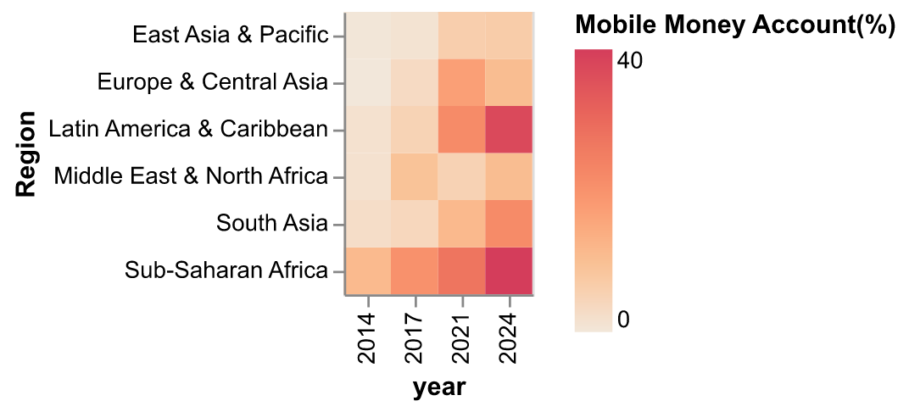

# Financial Inclusion in South Asia

Sarah Hussain

## What is your current goal? Has it changed since the proposal?
Through this project, I explore key indicators of financial inclusion using the World Bank’s Global Findex dataset. The analysis focuses on account ownership (through banks and mobile money), savings, and financial resilience—areas critical for policymakers in low-income countries where many lack access to formal and digital financial services.
While my initial plan was to combine these demand-side indicators with the IMF’s Financial Access Survey (FAS), which captures supply-side data, I have since chosen to focus on the demand side. This allows for a deeper understanding of the state of financial access and the gaps in account ownership by gender, income, and age.
Examining saving behaviors provides additional insight into which methods are most effective in South Asia, while measuring financial resilience highlights whether inclusion efforts are truly empowering individuals. Overall, this analysis offers policymakers a snapshot of current access levels—and, by extension, the state of savings and resilience—across South Asia.

## Are there data challenges you are facing? Are you currently depending on mock data?

I have not faced any data challenges and am using real data.

## Describe each of the provided images with 2-3 sentences to give the context and how it relates to your goal.

## South Asia vs World

This chart compares account ownership (through banks and similar institutions) across global regions. While ownership has increased everywhere since 2011, South Asia still lags behind most regions—though it ranks higher than Sub-Saharan Africa and the Middle East & North Africa (MENA). (High-income countries are excluded.)

Mobile money accounts offer a cheaper, more accessible alternative to traditional banking. In 2024, South Asia had a higher share of adults with mobile accounts than MENA but remained below all other regions.

Greater access to financial services should promote saving. In South Asia, both formal and informal savings have risen, with more adults now using formal methods. However, overall saving rates remain lower than in most regions, except MENA. 

Financial resilience is the ability to raise funds within 30 days when needed—is lowest in South Asia. This underscores the region’s greater need for stronger financial inclusion to protect individuals from economic shocks.

## Within South Asia

Focusing on South Asia’s largest economies—India, Bangladesh, and Pakistan—reveals wide differences. India leads with the highest account ownership, while Pakistan trails behind. In all three, mobile money usage remains below formal bank ownership.

Across the region, women are far less likely than men to have bank accounts. Percentages are calculated within each gender group (e.g., % of adult women, not % of all adults). These gaps likely reflect social norms and barriers to women’s access. 

Gender gaps extend to mobile money ownership, reflecting unequal access to technology. In many areas, women face restrictions on mobile phone ownership. Each dot represents a year (2011–2024); Pakistan only has data for 2024. In all three countries, far fewer women report having mobile money accounts

Income also shapes financial access. Comparing the poorest 40% with the richest 60%, the gap is narrowing over time but remains large in Pakistan. India continues to outperform the region in both income groups.

A key goal of financial inclusion is to encourage formal saving—via banks or mobile money accounts—rather than informal savings clubs. India shows higher use of formal methods, Bangladesh fluctuates, and Pakistan relies more on informal saving. This raises the question: should policies seek to change saving behavior or strengthen existing informal systems?

The chart below compares financial resilience in 2021 and 2024. Interestingly, India—despite leading in account ownership and formal savings—shows similar resilience levels to Bangladesh and Pakistan. This suggests that financial inclusion alone may not be sufficient to lift households out of vulnerability.

## What form do you envision your final narrative taking? (e.g. An article incorporating the images? A poster? An infographic?)
An infographic.
